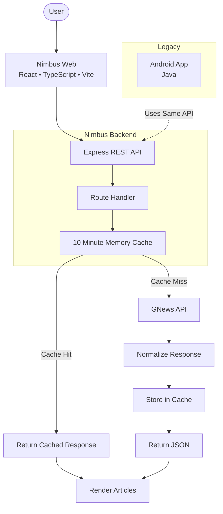

# Nimbus – News Aggregator

> A news aggregation platform built around a centralized Express API, providing a responsive React web client while preserving the original Android implementation as a legacy reference.

**[Nimbus](nimbus-lake.vercel.app/)** is a lightweight, API-driven news aggregator designed around a shared backend architecture. Instead of allowing individual clients to communicate directly with external news providers, Nimbus routes every request through a centralized Express API that securely handles API credentials, normalizes responses, and serves a consistent REST interface.

The project originally began as **~~The Daily Wave~~**, a native Android application developed in Java as a college project. As the NewsAPI free tier was discontinued for production use, the project was redesigned into a modern multi-platform architecture featuring a shared backend and a completely rebuilt web interface using React and TypeScript.

Today, Nimbus consists of three independent environments:
- **[Nimbus API](https://nimbus-api-backend.vercel.app/)** — Express.js backend
- **[Nimbus Web](nimbus-lake.vercel.app/)** — React + TypeScript frontend
- **Nimbus Android (Legacy)** — Original Java implementation preserved for reference

> Although the Android application remains functional and continues to fetch news through the shared Nimbus API, it is preserved as a legacy implementation. Its user interface reflects the original design from its initial development, that is no longer being updated or maintained for very long period. Development has since moved entirely to the modern web application powered by the shared Express backend.

---

## Features
- React + TypeScript web application
- Shared Express REST API
- Secure server-side API key management
- Browse news by category
- Search news articles by keyword
- Responsive news layout
- Read articles directly from their original source
- Unified API responses across clients
- 10-minute server-side response caching
- Vercel serverless deployment
- Legacy Android client included for historical reference

---

<h2>Technology Stack</h2>

| Technology | Purpose |
|------------|---------|
| React | Web frontend |
| TypeScript | Frontend development |
| Vite | Build tooling |
| Tailwind CSS | UI styling |
| Express.js | REST API |
| Node.js | Backend runtime |
| Axios | HTTP client |
| GNews API | News provider |
| Vercel | Backend & frontend deployment |
| Java | Legacy Android application |
| Android Studio | Legacy Android development |

---

|  |  |  |
|:-:|:-:|:-:|

---

# Architecture

---

# Development Notes

### Project Evolution

Nimbus originally started as a native Android college project. Following changes to the NewsAPI free tier, the project was redesigned around a centralized backend architecture, allowing multiple clients to consume the same REST API without exposing API credentials.

The result is a cleaner, easier-to-maintain architecture where the backend acts as a dedicated gateway while the frontend focuses solely on the user experience.

### Repository Organization

The repository is organized as a monorepo containing independent applications that share a common backend.
